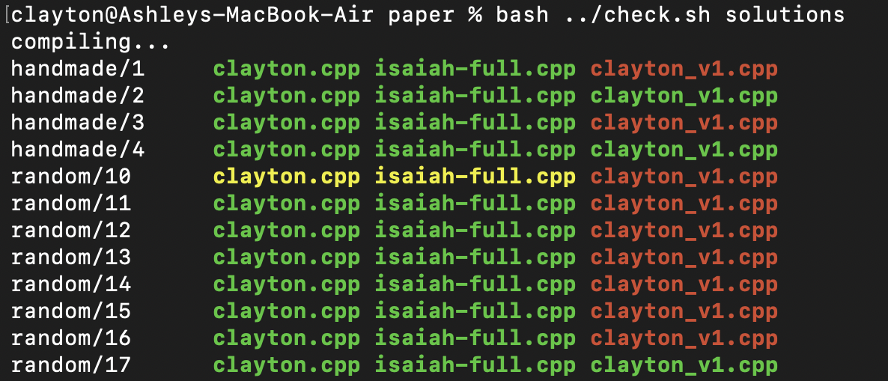

# Clayton's Problems
Some competitive programming problems I've written throughout my career for ebullient entities such as UNSW CPMSoc, COMP4128 and UNSW Prog Comp. This repo is mainly for nosy recruiters haha, but also for prospective problem setters who want to learn some tricks of the trade. And what a trade it is.

## Overview
In this repo there are 25 problems! WOah! Each directory in root (except for ideas and images) contains a problem statement, solutions, test case data, and a test case generator along with occasionally validators, images for the problem statement and explanations. Each directory also contains an attribution.md where you can find out who helped me write these problems as well as some context as to why these problems exist.

### Comparing solutions
To compare solutions with each other, ```cd``` into a problem directory and use the command ```bash ../check.sh <directory or solution file>```. Ommiting the argument will default to ```solutions/accepted```. 



The leftmost column represents each test case, while the remaining columns represent the outcomes of each test case applied to each solution. Green means the solution is accepted (AC), red means the solution outputs the wrong answer (WA) and yellow represents time limit exceeded (TLE). Write your own solutions to see how they compare!

### Writing your own problems
CPMSoc relies on testlib.h to write test case generators and validators for contests. Generators rely on random number generation to create large test cases that are unable to be written by hand and validators validate that the test cases adhere to the constraints outlined in problem statements. Consult the docs as well as this great codeforces resource to aid in your struggle. 

https://github.com/MikeMirzayanov/testlib \
https://codeforces.com/testlib

There are many examples of generators and validators within this repo too. After you have generated your test cases use ```bash ../validate.sh``` to validate them and ```bash ../solver.sh <solution file>``` to generate their respective expected outputs. Now you can use ```check.sh``` again to compare your solutions. It's a piece of cake. Which you can't have and eat too.

### Ideas
Not all my ideas made it into contests, but luckily they made their way into my heart and also into the ```ideas``` directory. There are some bangers in here, but alas the world was not ready for them. 

### Fin
And there you have it, my life's work. Pray that one day I either return to the force or go on to do better things. But really what could be better than competitive programming? What a beautiful thing it is. A shining eleven pointed star, shining far away and few between. An eternal crystal, a chrysalis you either wait for or wait for without. A silent prayer you hear whispered by a wise watchman, standing sigil upon a white, worn clock tower, a crown upon his head and soot beneath his feet, once dormant red brick then galvanised by lightning, a visit paid quick to solace seekers nightly. 

How can you not be romantic about competitive programming? 
